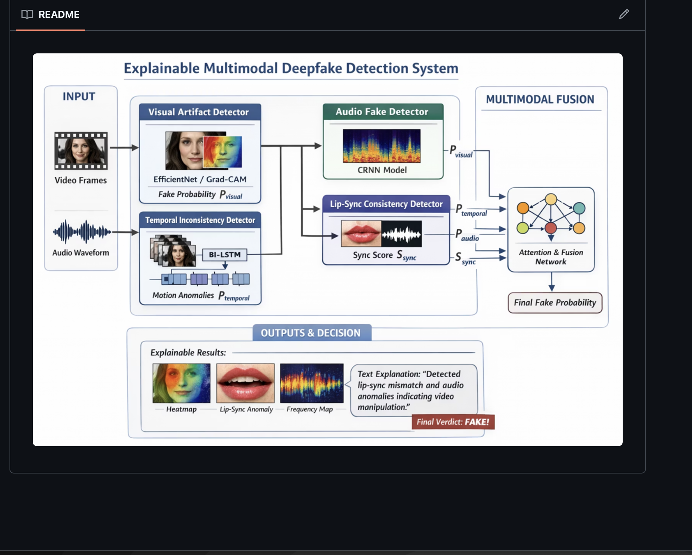

# Explainable Multimodal Deepfake Detection

**Visual • Temporal • Audio • Lip-Sync • Frequency Analysis**

A multimodal deep learning system that detects deepfake videos by combining five independent forensic signals — facial artifacts, motion inconsistencies, audio anomalies, lip-sync mismatches, and frequency-domain fingerprints — into a single, explainable verdict.

---

## Overview

Most deepfake detectors rely on a single modality (usually visual artifacts), which makes them brittle against newer generation techniques that specifically target that weakness. This project takes a **multimodal, explainable** approach: five specialized models each analyze a different dimension of the video/audio, and an attention-weighted fusion network combines their outputs into a final decision — along with a human-readable explanation of *why* the video was flagged.

<p align="center">
  
</p>

---

## System Architecture

| Stage | Component | Description |
|---|---|---|
| **Input** | Video Frames + Audio Waveform | Raw video decoded into frames and audio extracted at 16kHz |
| **Visual Artifact Detector** | EfficientNet-B4 + Grad-CAM | Detects pixel-level manipulation artifacts on face crops; outputs `P_visual` with a Grad-CAM heatmap |
| **Temporal Inconsistency Detector** | Bi-LSTM + Bahdanau Attention | Models motion anomalies across frame sequences; outputs `P_temporal` |
| **Audio Fake Detector** | CRNN (BiGRU) + SpecAugment | Analyzes mel spectrograms for synthetic audio artifacts; outputs `P_audio` |
| **Lip-Sync Consistency Detector** | SyncNet-style Dual Encoder | Measures audio-visual sync via contrastive embedding distance; outputs `S_sync` |
| **Frequency Forensics Detector** | FFT-based CNN | Detects GAN spectral fingerprints and checkerboard artifacts from transposed convolutions |
| **Multimodal Fusion** | Attention & Fusion Network | Learns per-modality weights and combines `P_visual`, `P_temporal`, `P_audio`, `S_sync` into a **Final Fake Probability** |
| **Output** | Explainable Results | Heatmaps, lip-sync anomaly frames, frequency maps, and a natural-language explanation of the verdict |

---

## Key Results

| Modality | Model | Metric |
|---|---|---|
| Visual | EfficientNet-B4 | ~99% Accuracy / AUC |
| Fusion (all modalities) | Attention-weighted Late Fusion | AUC = 0.84 |

The visual modality carries the highest fusion weight (α ≈ 0.31), reflecting its individually strong performance, while the audio branch is comparatively weaker due to training data constraints — a known limitation addressed in the Future Work section below.

> Full metrics, confusion matrices, and per-modality breakdowns are in [`results.md`](results.md).

---

## Repository Structure

This project is organized as a sequence of Jupyter/Colab notebooks, each responsible for one stage of the pipeline:

| Notebook | Stage |
|---|---|
| `NB00` – `NB03` | Data ingestion, frame extraction (1fps), SSD face detection, iBUG 68-point landmark alignment, face/mouth ROI cropping |
| `NB04` | Mel spectrogram generation (128-band, 128×128, 3s segments @ 16kHz) |
| `NB05` | Visual CNN — EfficientNet-B4 (MBConv + Squeeze-and-Excitation attention) |
| `NB06` | Temporal Bi-LSTM with Bahdanau attention |
| `NB07` | Audio CRNN with SpecAugment |
| `NB08` | Lip-Sync SyncNet-style dual encoder (contrastive learning) |
| `NB09` | Frequency forensics CNN (FFT-based) |
| `NB10` | Attention-weighted late fusion |
| `NB11` – `NB13` | Explainability (Grad-CAM, natural language output), evaluation, and demo pipeline |

---

## Tech Stack

- **Deep Learning:** PyTorch, `timm` (EfficientNet-B4)
- **Computer Vision:** OpenCV (SSD face detection), dlib (landmark alignment)
- **Audio Processing:** librosa, soundfile, moviepy (FFmpeg-backed audio extraction)
- **Fusion / Metrics:** scikit-learn (L-BFGS logistic regression), NumPy, SciPy
- **Explainability:** Grad-CAM
- **Training:** AdamW / Adam optimizers, BCEWithLogitsLoss, CosineAnnealingLR, gradient clipping (norm = 1.0)
- **Environment:** Google Colab (T4 GPU), Google Drive

---

## Getting Started

### 1. Clone the repository
```bash
git clone https://github.com/<your-username>/<your-repo>.git
cd <your-repo>
```

### 2. Install dependencies
```bash
pip install -r requirements.txt
```

### 3. Run the notebooks in order
Open the notebooks (`NB00` → `NB13`) in Google Colab or Jupyter, in sequence — each stage depends on artifacts produced by the previous one (extracted frames, face crops, spectrograms, and trained model checkpoints).

### 4. Run inference on a new video
See `NB13` (demo pipeline) for an end-to-end example: input a raw video → get a final fake probability with explainable outputs (heatmap, lip-sync anomaly, frequency map, and text explanation).

---

## Example Output

For a manipulated input video, the system produces:

- **Heatmap** — Grad-CAM localization of visual artifacts (e.g., mouth/eye region)
- **Lip-Sync Anomaly** — frames showing audio-visual desynchronization
- **Frequency Map** — spectral fingerprint indicating GAN-based generation
- **Text Explanation** — e.g., *"Detected lip-sync mismatch and audio anomalies indicating video manipulation."*
- **Final Verdict** — `FAKE` or `REAL`, with the fused probability score

---

## Limitations & Future Work

- **Audio modality** underperforms relative to other branches due to limited training data; pretraining with **Wav2Vec2** is identified as the primary improvement path.
- **Dataset scale** — expanding training data across more manipulation types (face-swap, reenactment, lip-sync-only) would improve generalization.
- **Real-time inference** — current pipeline is optimized for accuracy over latency; a lightweight variant could be explored for deployment.

---

## Team

This is a Senior Design Project developed by a 3-member team:

| Member | Responsibility |
|---|---|
| Member 1 | Project introduction & problem framing |
| Member 2 | Data preprocessing pipeline & detection models (visual, temporal, audio, lip-sync, frequency, fusion) |
| Member 3 | Live demo & end-to-end system integration |

---

## License

Specify your license here (e.g., MIT, Apache 2.0), or note that this is an academic project not intended for redistribution.
